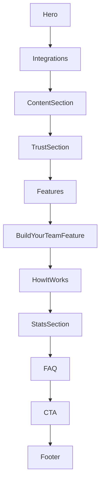

# Unified Design Framework

## Section Order
1. [`Hero.astro`](apps/landing-page/src/sections/Hero.astro:49)  
2. [`Integrations.astro`](apps/landing-page/src/sections/Integrations.astro:4)  
3. [`ContentSection.astro`](apps/landing-page/src/sections/ContentSection.astro:5)  
4. [`TrustSection.astro`](apps/landing-page/src/sections/TrustSection.astro:1)  
5. [`Features.astro`](apps/landing-page/src/sections/Features.astro:34)  
6. [`BuildYourTeamFeature.astro`](apps/landing-page/src/sections/BuildYourTeamFeature.astro:5)  
7. [`HowItWorks.astro`](apps/landing-page/src/sections/HowItWorks.astro:71)  
8. [`StatsSection.astro`](apps/landing-page/src/sections/StatsSection.astro:4)  
9. [`FAQ.astro`](apps/landing-page/src/sections/FAQ.astro:5)  
10. [`CTA.astro`](apps/landing-page/src/sections/CTA.astro:5)  
11. [`Footer.astro`](apps/landing-page/src/sections/Footer.astro:1)  

## Wireframe Flow

## Style Guidelines

### Color Palette
- Primary: `var(--color-primary)`
- Primary fg: `var(--color-primary-foreground)`
- Secondary: `var(--color-secondary)`
- Secondary fg: `var(--color-secondary-foreground)`
- Accent: `var(--color-accent)`
- Accent fg: `var(--color-accent-foreground)`
- Background: `var(--color-background)`
- Foreground: `var(--color-foreground)`
- Muted bg: `var(--color-muted)`
- Muted fg: `var(--color-muted-foreground)`
- Borders: `var(--color-border)`
- Shadows: use `var(--shadow-md)` … `var(--shadow-xl)`

### Typography
- Font Stack: `font-family: var(--font-sans)`
- H1: `font-size: 2.5rem; font-weight: 700; letter-spacing: var(--tracking-tight)`
- H2: `font-size: 2rem; font-weight: 600`
- H3: `font-size: 1.5rem; font-weight: 600`
- Body: `font-size: 1rem; font-weight: 400; line-height: 1.5`
- Text-balance: use Tailwind’s `text-balance` utility

### Spacing & Layout
- Sections: `py-24` (6rem) default; smaller use `py-12` or `py-16`
- Containers: `container mx-auto px-6`
- Grids: `gap-4`
- Global Padding: apply `p-4` consistently